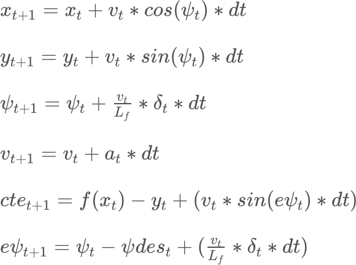

# Model Predictive Control
---

This is a program to control a car using Model Predictive Control algorithm. This algorithm uses optimizer (IPOPT) to find the control inputs that minimize the cost/objective function while adhering to the non-holonomic constraints of the car.


## Model description

This program uses kinematic model consisting of 6 parameters: x position, y position, orientation, velocity, cross-track-error and orientation-error. The car is actuated using steering angle and throttle. At each timestep the model uses the state and actuations from the previous timestep to predict the positions of the car in the prediction horizon (the duration over which the future predictions are made). However, we only move the car to the first predicted state and recalculate the predictions from the new state. The equations used to predict the future state of the car are:




## N and dt values

The **dt**(timestep) and the **N**(number of time steps) chosen for this program are 0.1 seconds and 10, respectively. These values correspond to the prediction horizon of 1 second. Since the road curvature of the track in the simulator changes frequently, the optimum choice of prediction horizon was 1 second. The value combination of (10, 0.5) and (20, 0.1) were tried, but the smaller timesteps result in wavy motion of the car, and predicting 2 seconds resulted in slightly slower performance (though not so noticeable on modern hardware) and often the predicted path wavered off the track.


## Pre-processing of waypoints

The waypoints were translated and then rotated by car's initial orientation, resulting in the waypoint coordinates in car's coordinate system. This also resulted the car's initial position to be x = 0 and y = 0. This enabled easier and faster calculation of coefficients, cross-track-error and orientation-error. The pre-processing of waypoints can be seen in `main.cpp` thorugh `lines 100-115`.


## Adding actuation latency

The latency was added to the state before passing the values to the mpc solver. The latency was added using the same equations as above, but with dt = latency = 0.1 seconds. This will cause the prediction to start 100 ms later than the vehicle's current position, thus simulating the latency in actuation. This can be seen in `main.cpp` through `lines 130-136`.


## Dependencies

* cmake >= 3.5
 * All OSes: [click here for installation instructions](https://cmake.org/install/)
* make >= 4.1(mac, linux), 3.81(Windows)
  * Linux: make is installed by default on most Linux distros
  * Mac: [install Xcode command line tools to get make](https://developer.apple.com/xcode/features/)
  * Windows: [Click here for installation instructions](http://gnuwin32.sourceforge.net/packages/make.htm)
* gcc/g++ >= 5.4
  * Linux: gcc / g++ is installed by default on most Linux distros
  * Mac: same deal as make - [install Xcode command line tools]((https://developer.apple.com/xcode/features/)
  * Windows: recommend using [MinGW](http://www.mingw.org/)
* [uWebSockets](https://github.com/uWebSockets/uWebSockets)
  * Run either `install-mac.sh` or `install-ubuntu.sh`.
  * If you install from source, checkout to commit `e94b6e1`, i.e.
    ```
    git clone https://github.com/uWebSockets/uWebSockets
    cd uWebSockets
    git checkout e94b6e1
    ```
    Some function signatures have changed in v0.14.x. See [this PR](https://github.com/udacity/CarND-MPC-Project/pull/3) for more details.

* **Ipopt and CppAD:** Please refer to [this document](https://github.com/udacity/CarND-MPC-Project/blob/master/install_Ipopt_CppAD.md) for installation instructions.
* [Eigen](http://eigen.tuxfamily.org/index.php?title=Main_Page). This is already part of the repo so you shouldn't have to worry about it.
* Simulator. You can download these from the [releases tab](https://github.com/udacity/self-driving-car-sim/releases).
* Not a dependency but read the [DATA.md](./DATA.md) for a description of the data sent back from the simulator.


## Basic Build Instructions

1. Clone this repo.
2. Make a build directory: `mkdir build && cd build`
3. Compile: `cmake .. && make`
4. Run it: `./mpc`.